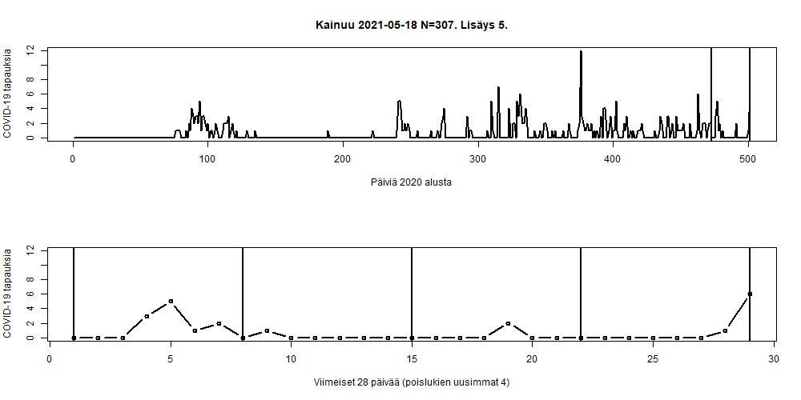
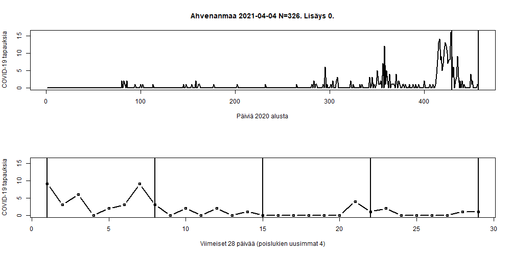

# Koronavirus avoindata

Analyzing (https://github.com/HS-Datadesk/koronavirus-avoindata) data about COVID-19 in Finland.

```
# Load data from hs-avoindata

processedThlData<-fromJSON("https://w3qa5ydb4l.execute-api.eu-west-1.amazonaws.com/prod/processedThlData")
finnishCoronaHospitalData<-fromJSON("https://w3qa5ydb4l.execute-api.eu-west-1.amazonaws.com/prod/finnishCoronaHospitalData")
thlTestData<-fromJSON("https://w3qa5ydb4l.execute-api.eu-west-1.amazonaws.com/prod/thlTestData")
hcdTestData<-fromJSON("https://w3qa5ydb4l.execute-api.eu-west-1.amazonaws.com/prod/hcdTestData")
finnishVaccinationData<-fromJSON("https://w3qa5ydb4l.execute-api.eu-west-1.amazonaws.com/prod/finnishVaccinationData")

```

Using [hs-koronavirus-avoindata.r](hs-koronavirus-avoindata.r). See also R Markdown version

```
git add .
git commit -m  "Update"
```

Graphs has last 4 days removed. See also gif as last image.





Gif version.

End