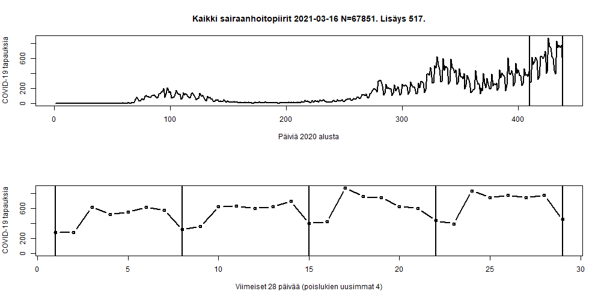

# Koronavirus avoindata

Reading https://github.com/HS-Datadesk/koronavirus-avoindata COVID-19 cases in Finland and plots some graphs.

```
# Load data from hs-avoindata

json<-fromJSON("https://w3qa5ydb4l.execute-api.eu-west-1.amazonaws.com/prod/processedThlData")
```





End


 
