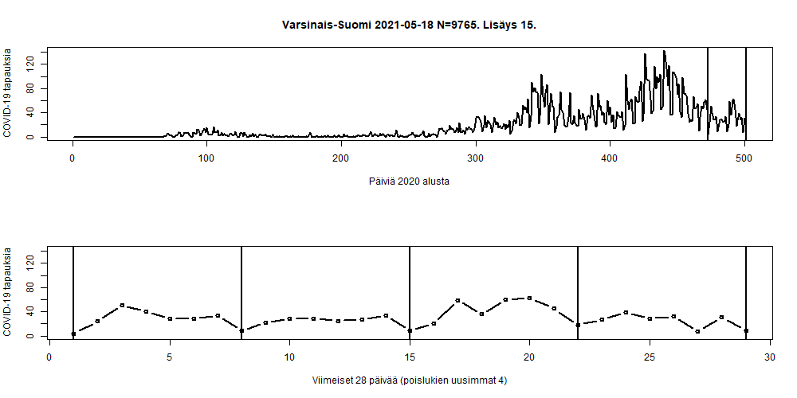
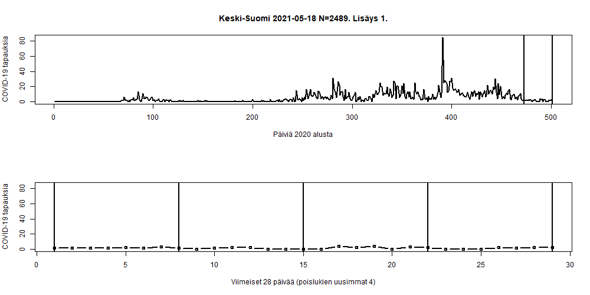
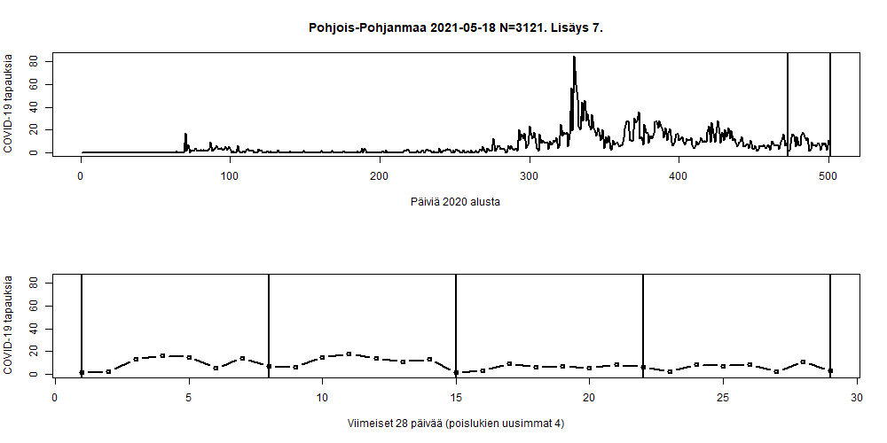
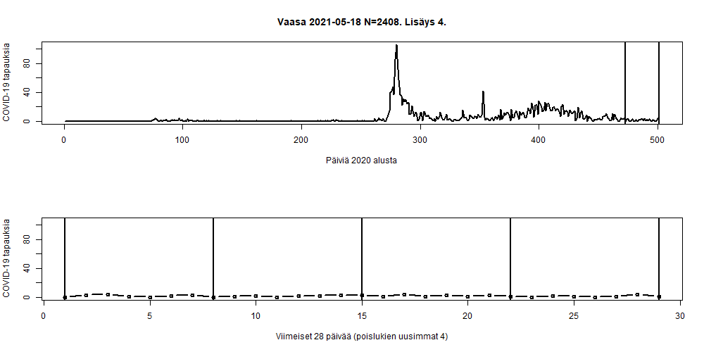
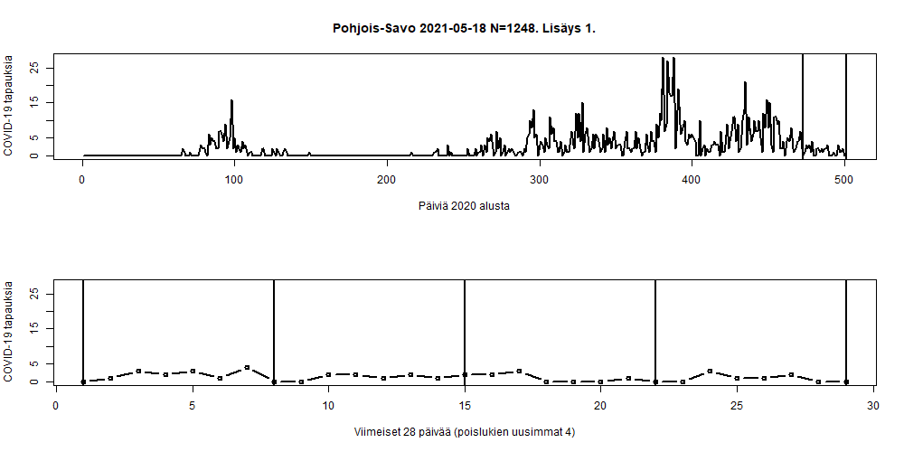
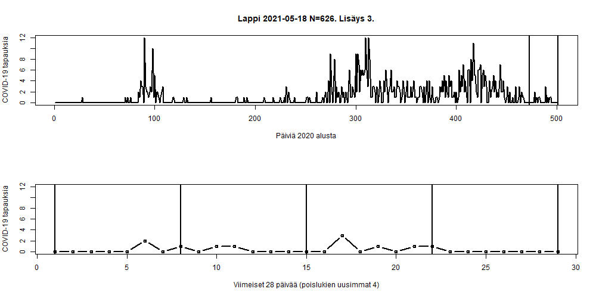
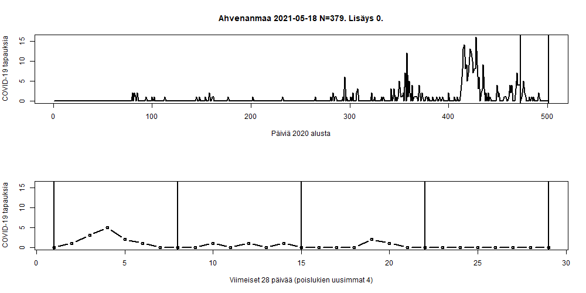

# Koronavirus avoindata

Reading https://github.com/HS-Datadesk/koronavirus-avoindata COVID-19 cases in Finland and plots some graphs.

```
# Load data from hs-avoindata

json<-fromJSON(.png)https://w3qa5ydb4l.execute-api.eu-west-1.amazonaws.com/prod/processedThlData.png))
```

Using [hs-koronavirus-avoindata.r](hs-koronavirus-avoindata.r)

```
git add .
git commit -a -m  "Update"
```

















End